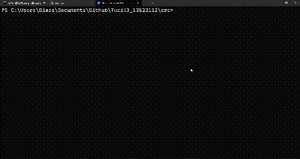

# Penyelesaian Permainan Word Ladder Menggunakan Algoritma UCS, Greedy Best First Search, dan A*
> Tugas Kecil 3 IF2211 Strategi Algoritma
> Semester II tahun 2023/2024

## Table of Contents
* [General Info](#general-information)
* [Technologies Used](#technologies-used)
* [Features](#features)
* [Screenshots](#screenshots)
* [Setup](#setup)
* [Usage](#usage)
* [Contact](#contact)

## General Information

Word ladder (juga dikenal sebagai Doublets, word-links, change-the-word puzzles, paragrams, laddergrams, atau word golf) adalah salah satu permainan kata yang terkenal bagi seluruh kalangan. Word ladder ditemukan oleh Lewis Carroll, seorang penulis dan matematikawan, pada tahun 1877. Pada permainan ini, pemain diberikan dua kata yang disebut sebagai start word dan end word. Untuk memenangkan permainan, pemain harus menemukan rantai kata yang dapat menghubungkan antara start word dan end word. Banyaknya huruf pada start word dan end word selalu sama. Tiap kata yang berdekatan dalam rantai kata tersebut hanya boleh berbeda satu huruf saja. Pada permainan ini, diharapkan solusi optimal, yaitu solusi yang meminimalkan banyaknya kata yang dimasukkan pada rantai kata

## Technologies Used
- Java

## Features
List the ready features here:
- UCS
- Greedy Best first Search
- A*

## Screenshots

## Setup

Pastikan anda telah menginstall java pada perangkat anda

https://phoenixnap.com/kb/install-java-windows

## Usage

Bila ingin menggunakan program pastikan anda berada di path yang benar yaitu di folder src

`cd src`

Menjalankan word ladder solver pada CLI

`javac App.java`

`java App.java`

## Contact
Created by DIMAS BAGOES | 13522112
